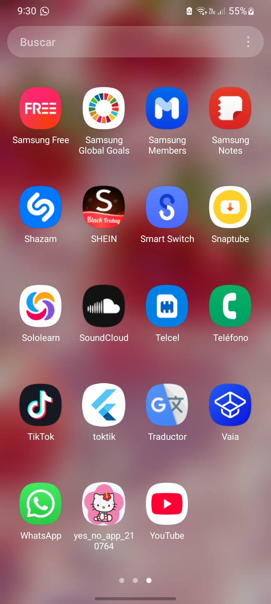
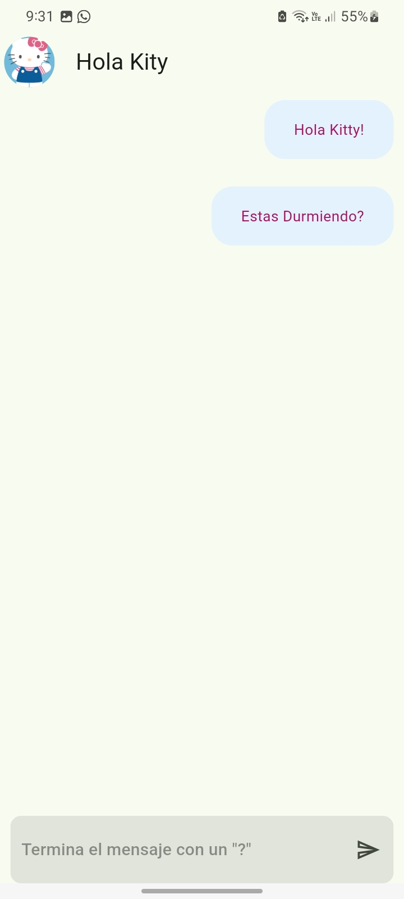
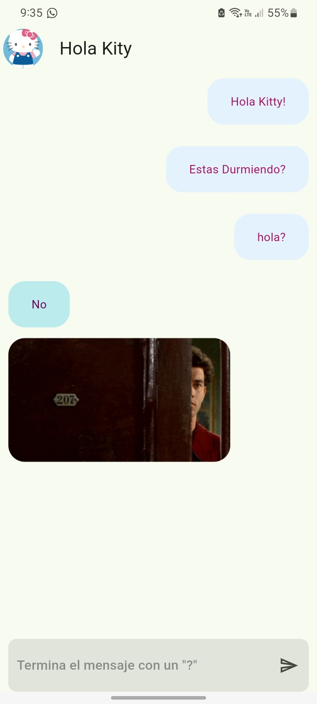

# DMI-10A-YesNoApp-210764-V2
Primera aplicacion realizada en Flutter para Dispositivos, parte de la unidad 2 de la asignatura de Desarrollo Movil Integral

## DESCRIPCION:

Proyecto de Clase para la Unidad 2 de la Asignatura de Desarrollo Móvil Integral (DMI) impartida
por el M.T.I Marco A. Ramírez Hernández

## HISTORIAL DE PRÁCTICAS:
| No. | Nombre                                                  | Firmas | Estatus |
|-----|---------------------------------------------------------|-------------|---------|
| 22  | Implementación de la UI para la Aplicación de Yes/No     | 10           | Activa  |
| 23  | Implementación de la Funcionalidad de la Aplicación de Yes/No | 10       | Activa  |

## LISTA DE HERRAMIENTAS

## AUTOR
Elaborado por: [Karen Alyn Fosado Rodríguez](https://github.com/KarenFosado)

| Nombre del estudiante          |  Carrera|
|---------------------------------|----------------------------|
| Karen Alyn Fosado Rodríguez                        | Ingeniería en Desarrollo de Software |

## ScreenShots

